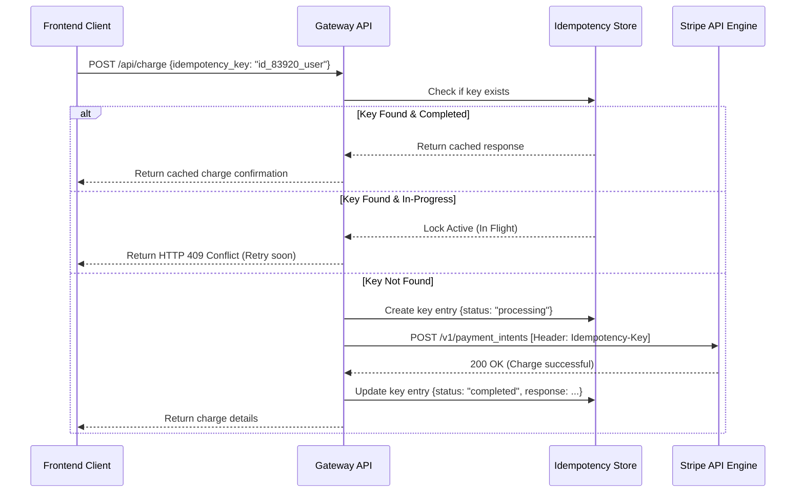

# Knowledge Guide: Stripe Webhook Security & Payment Exception Recovery

This guide establishes the backend security protocols, idempotent API patterns, and billing recovery workflows for our financial conversion funnel. It ensures developers implement zero-fault transaction interfaces.

---

## 🔒 1. Webhook Signature Verification

To prevent replay attacks and spoofed notifications, all endpoint hooks from Stripe must be validated using the endpoint's **Webhook Secret** (`whsec_...`).

### Implementation Reference Pattern (FastAPI/Python)
```python
import hmac
import hashlib
import time
from fastapi import Request, HTTPException, status

def verify_stripe_signature(payload: bytes, sig_header: str, endpoint_secret: str):
    """
    Manually verifies the Stripe signature header using HMAC-SHA256.
    Avoids direct dependency imports for security verification layers.
    """
    try:
        # 1. Parse signature header (t=TIMESTAMP,v1=SIGNATURE)
        pairs = dict(pair.split('=') for pair in sig_header.split(','))
        timestamp = pairs.get('t')
        signature_v1 = pairs.get('v1')
        
        if not timestamp or not signature_v1:
            raise ValueError("Missing timestamp or signature v1 elements")

        # 2. Prevent replay attacks (Reject events older than 5 minutes)
        if time.time() - float(timestamp) > 300:
            raise ValueError("Timestamp expired. Possible replay attack.")

        # 3. Construct signing payload
        signed_payload = f"{timestamp}.{payload.decode('utf-8')}".encode('utf-8')

        # 4. Calculate expected HMAC-SHA256 signature
        expected_sig = hmac.new(
            endpoint_secret.encode('utf-8'),
            signed_payload,
            hashlib.sha256
        ).hexdigest()

        # 5. Constant-time comparison to prevent timing side-channel attacks
        if not hmac.compare_digest(expected_sig, signature_v1):
            raise ValueError("Signature mismatch")
            
    except Exception as e:
        raise HTTPException(
            status_code=status.HTTP_400_BAD_REQUEST,
            detail=f"Webhook signature verification failed: {str(e)}"
        )
```

---

## ⚡ 2. Idempotent Requests (Prevent Double Charges)

In distributed microservice networks, temporary client timeouts can cause duplicate billing requests. To guarantee an operation is only executed exactly once, all charging requests must transmit a unique **Idempotency Key**.

### Request Lifecycle Workflow



---

## ⏳ 3. Dunning Management & Grace Period Workflows

When a recurring subscription charge fails (e.g. card expired, insufficient funds), the system must execute a **Grace Recovery Flow** to minimize customer friction while retaining conversion pressure.

### Culpability State Machine & Retry Schedule

```
[Active Status]
     │
     ▼ (Subscription Charge Failed)
[Past Due / Grace Period] ──► Toggle Low-Decibel Conversion UX (Orange alert banner)
     │
     ├─► Retry 1: 3 days later
     ├─► Retry 2: 6 days later ──► Upgrade to High-Decibel Glitch UI (Red Warning Banner)
     │
     ▼ (Failed all 3 Smart Retries)
[Unpaid / Revoked Status] ──► Complete Paywall Block (Force Gateway UI)
```

### Strategic Guidelines
1. **The Grace Window:** Provide a **7-day Grace Period** for Enterprise Tier contracts. The service access remains active, but a persistent *Orange alert notification* is displayed.
2. **Dynamic UI Elevation:** If the account enters Day 5 of past-due status without update, the UI automatically transitions to the **CRITICAL Warning state** (red flashing, audio sirens on diagnostic page) to prompt immediate billing update.
3. **Smart Retries:** Configure Stripe's revenue recovery tools to perform smart retries (using ML-based scheduling) instead of daily retries to avoid triggering bank fraud flags.
